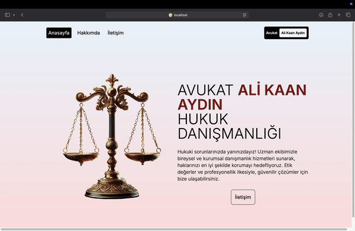

# Lawyer Portfolio

This project aims to develop a website for Lawyer Ali Kaan Aydın. The website allows users to get information about the lawyer, contact him, and learn more about the services offered.

## Table of Contents

- [Installation](#installation)
- [Usage](#usage)
- [Tools and Libraries](#tools-and-libraries)
- [Project Structure](#project-structure)
- [Screenshots](#screenshots)
- [Contributors](#contributors)
- [License](#license)

## Installation

To run the project locally, follow these steps:

1. Clone the repository:
   ```bash
   git clone https://github.com/username/lawyer-portfolio.git
   cd lawyer-portfolio
   ```

2. Install the necessary dependencies:
   ```bash
   npm install
   ```

3. Set up environment variables:
   Add your Google Maps API key to the `.env.local` file:
   ```
   NEXT_PUBLIC_GOOGLE_MAPS_API_KEY=YOUR_API_KEY_HERE
   ```

4. Start the development server:
   ```bash
   npm run dev
   ```

## Usage

The project is a Next.js-based web application. Once the development server is running, you can view the application in your browser at `http://localhost:3000`.

## Tools and Libraries

The main tools and libraries used in this project are:

- **Next.js**: A React framework with server-side rendering and static site generation features.
- **React**: A JavaScript library for building user interfaces.
- **Framer Motion**: A library for animations and transitions.
- **@react-google-maps/api**: A library for using Google Maps API in React applications.
- **Tailwind CSS**: A utility-first CSS framework for rapid UI development.

## Project Structure

- **src/app/contact/page.jsx**: Contact page with Google Maps integration and a contact form.
- **src/app/about/page.jsx**: About page with the lawyer's biography and areas of expertise.
- **src/app/components/navbar.jsx**: Navigation bar component for page transitions.
- **src/app/components/brain.jsx**: Animated SVG component.
- **src/app/layout.js**: Layout component used across the application.
- **src/app/components/transitionProvider.jsx**: Component providing page transition animations.

## Screenshots

Below is a GIF showcasing the page transition animation used in the project:




## License

This project is licensed under the MIT License. See the `LICENSE` file for more information.
